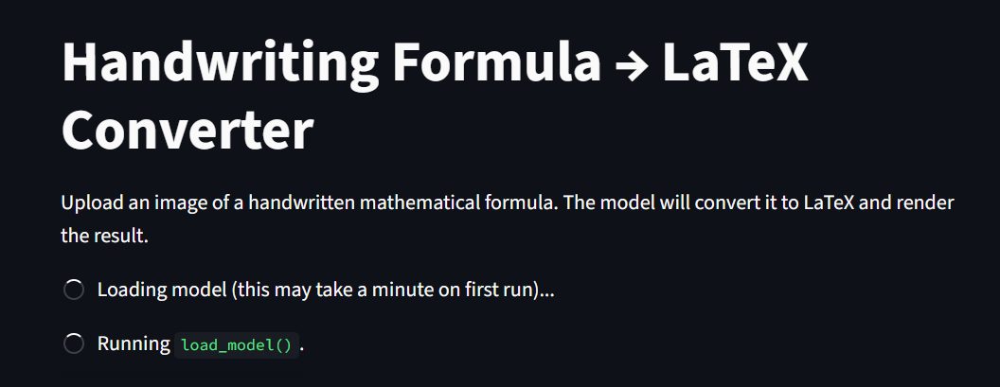
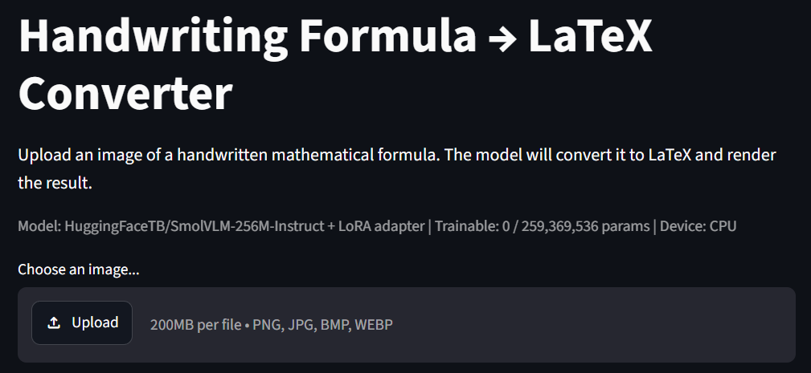
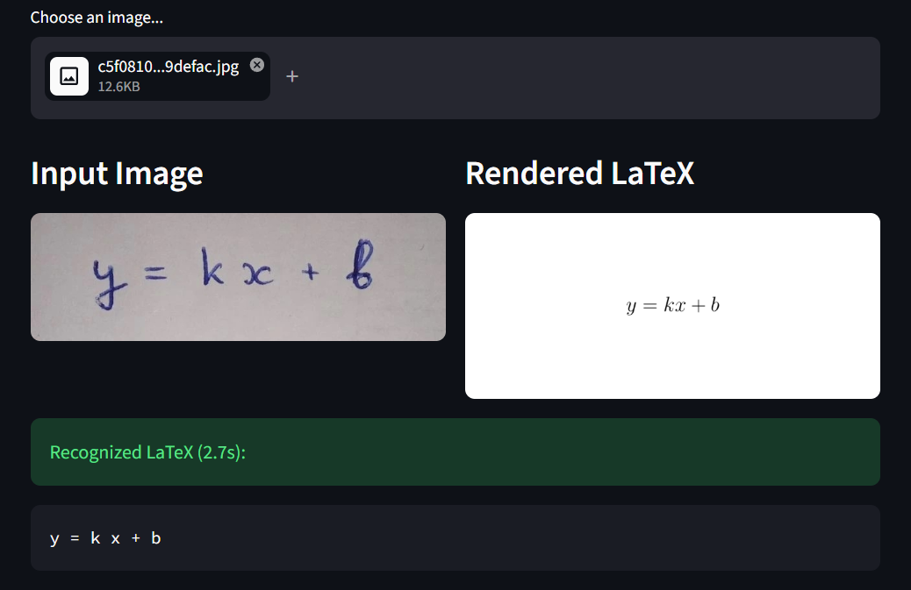
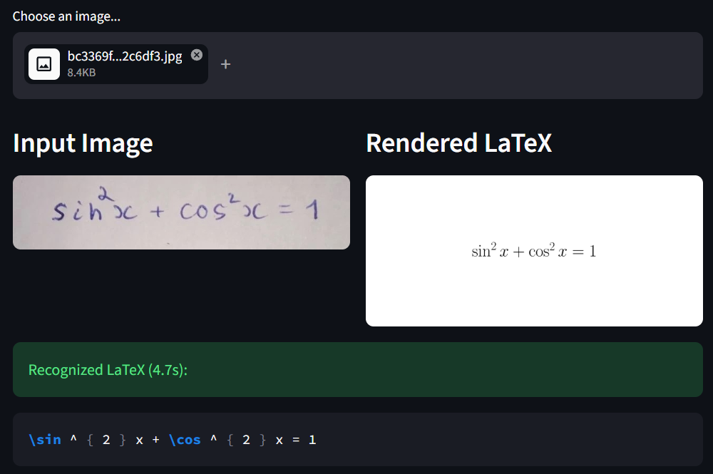
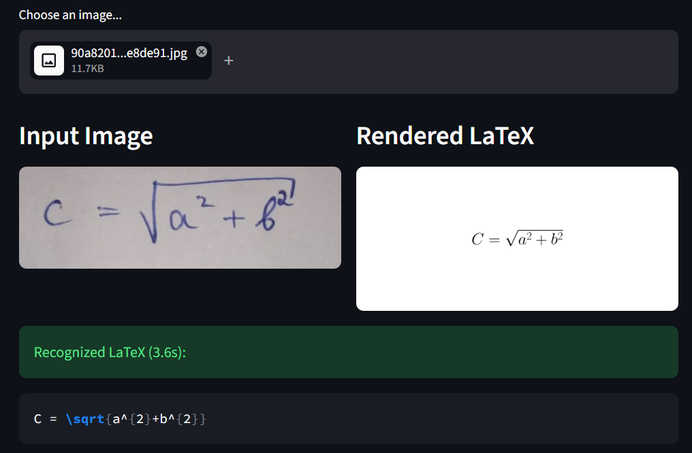
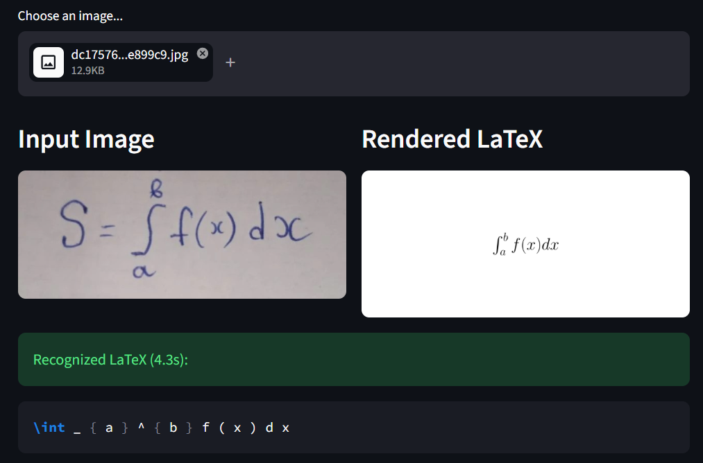

# Handwriting Formulas Improvement

Vision-Language Models fine-tuned for converting images of handwritten mathematical formulas into LaTeX code. Compares **SmolVLM-256M-Instruct** and **Qwen3-VL-2B-Instruct** under identical evaluation conditions across four experimental setups (zero-shot, one-shot, SFT on one dataset, SFT on combined datasets).

## Task Overview

- **Input:** Image of a handwritten mathematical formula
- **Output:** LaTeX source string + rendered formula preview
- **Models:** SmolVLM-256M-Instruct (256M params), Qwen3-VL-2B-Instruct (2B params)
- **Fine-tuning:** LoRA (Low-Rank Adaptation)
- **Evaluation:** linxy/LaTeX_OCR test split (70 examples)

## Results Summary

| Setup | Model | EM | CER | BLEU |
|-------|-------|----|-----|------|
| Zero-shot | SmolVLM-256M | 0.0% | 60.5% | 49.7 |
| One-shot | SmolVLM-256M | 0.0% | 45.6% | 42.4 |
| SFT (LaTeX_OCR) | SmolVLM-256M | 70.0% | 8.1% | 91.4 |
| **SFT (combined)** | **SmolVLM-256M** | **80.0%** | **4.1%** | **95.0** |
| Zero-shot | Qwen3-VL-2B | 0.0% | 24.1% | 73.6 |
| One-shot | Qwen3-VL-2B | 4.3% | 21.0% | 81.3 |
| SFT (LaTeX_OCR) | Qwen3-VL-2B | 94.3% | 0.4% | 98.9 |
| SFT (combined) | Qwen3-VL-2B | 85.7% | 3.3% | 95.1 |

The deployed application uses **SmolVLM-256M-Instruct** fine-tuned on the combined dataset (80% EM, 2.4x faster inference than Qwen3-VL).

## Project Structure

```
.
├── app.py                      # Streamlit application
├── requirements.txt            # Dependencies for running the app
├── technical_report.md         # Full technical report with experimental details
├── .gitignore
├── docs/
│   └── checkpoints.md          # Trained model checkpoints & download links
├── notebooks/
│   ├── data_prep.py            # Dataset loading & preprocessing utilities
│   ├── metrics.py              # Evaluation metrics (EM, CER, BLEU)
│   ├── 1_eda_and_setup.ipynb   # EDA, data quality analysis, metric definitions
│   ├── 2_smolvlm.ipynb         # SmolVLM baselines & fine-tuning
│   ├── 3_qwen3vl_1dataset.ipynb    # Qwen3-VL baselines & SFT on LaTeX_OCR
│   ├── 3_qwen3vl_2datasets.ipynb   # Qwen3-VL SFT on combined dataset
│   └── 4_comparison.ipynb      # Cross-model comparison & analysis
└── screenshots/
    └── demo1.png ... demo7.png    # Application demo on real handwritten formulas
```

## Datasets

| Dataset | Split Used | Examples | Format |
|---------|-----------|----------|--------|
| [linxy/LaTeX_OCR](https://huggingface.co/datasets/linxy/LaTeX_OCR) (`human_handwrite`) | train / val / test | 1,164 / 68 / 70 | RGBA PNG, space-tokenized LaTeX |
| [deepcopy/MathWriting-human](https://huggingface.co/datasets/deepcopy/MathWriting-human) | train (subsample) | 5,000 / 700 | RGB JPG, compact + spaced LaTeX |

## Evaluation Metrics

- **Exact Match (EM)** — fraction of predictions identical to the reference (whitespace-trimmed)
- **EM (normalised)** — exact match after removing all whitespace (handles format differences between datasets)
- **Character Error Rate (CER)** — Levenshtein edit distance / reference length, averaged over examples
- **BLEU** — SacreBLEU corpus-level score

All metrics are evaluated on the **LaTeX_OCR test split (70 examples)**.

## Quick Start — Streamlit Application

### 1. Install dependencies

```bash
pip install -r requirements.txt
```

### 2. Download the trained model

The LoRA adapter is stored on [Google Drive](https://drive.google.com/drive/folders/1nZKTGHxoEC6jBfQKXZQksT1GgvcQFgAE). Download the `smolvlm_lora_2datasets` folder and place it as:

```
your-project/
├── app.py
└── models/
    └── smolvlm_lora_2datasets/
        ├── adapter_config.json
        └── adapter_model.safetensors
```

### 3. Run the app

```bash
streamlit run app.py
```

Upload an image of a handwritten formula. The app displays the recognized LaTeX code and a rendered preview.

> **Note:** For high-quality LaTeX rendering, install a LaTeX distribution (TeX Live or MiKTeX). If unavailable, the app falls back to matplotlib's built-in mathtext renderer.

## Training

Training was performed in Google Colab (T4 GPU, 16 GB VRAM). See the notebooks for full reproducible code:

1. **`1_eda_and_setup.ipynb`** — Exploratory data analysis, duplicate detection, dataset preprocessing, metric definitions
2. **`2_smolvlm.ipynb`** — SmolVLM-256M: zero-shot, one-shot, LoRA SFT (1 and 2 datasets)
3. **`3_qwen3vl_1dataset.ipynb`** — Qwen3-VL-2B: zero-shot, one-shot, LoRA SFT on LaTeX_OCR
4. **`3_qwen3vl_2datasets.ipynb`** — Qwen3-VL-2B: LoRA SFT on combined dataset
5. **`4_comparison.ipynb`** — Cross-model comparison and analysis

### Training Hyperparameters

| Parameter | Value |
|-----------|-------|
| LoRA rank (`r`) | 8 |
| LoRA alpha | 8 |
| LoRA dropout | 0.05 |
| Target modules | `q_proj`, `k_proj`, `v_proj`, `o_proj`, `gate_proj`, `up_proj`, `down_proj` |
| Epochs | 2-3 |
| Batch size | 2 (effective 16 with grad accum 8) |
| Learning rate | 1e-4 |
| Optimiser | AdamW |
| Precision | bf16 |

## All Checkpoints

| Checkpoint | Model | Data | EM | CER |
|-----------|-------|------|----|-----|
| `smolvlm_lora_1dataset` | SmolVLM-256M | LaTeX_OCR (1,164) | 70.0% | 8.1% |
| `smolvlm_lora_2datasets` | SmolVLM-256M | LaTeX_OCR + MathWriting (6,164) | 80.0% | 4.1% |
| `qwen3vl_lora_1dataset` | Qwen3-VL-2B | LaTeX_OCR (1,164) | 94.3% | 0.4% |
| `qwen3vl_lora_2datasets` | Qwen3-VL-2B | LaTeX_OCR + MathWriting (1,864) | 85.7% | 3.3% |

Download: [Google Drive](https://drive.google.com/drive/folders/1nZKTGHxoEC6jBfQKXZQksT1GgvcQFgAE) (see [`docs/checkpoints.md`](docs/checkpoints.md) for details)

## Screenshots

The application was tested on real handwritten formulas written by the author.

| Input | Rendered LaTeX |
|-------|---------------|
|  |  |
|  |  |
|  |  |

## Technical Report

Full experimental details, analysis, and discussion are available in [`technical_report.md`](technical_report.md).

## References

- SmolVLM Team. *SmolVLM-256M-Instruct*. HuggingFace, 2025.
- Qwen Team. *Qwen3-VL-2B-Instruct*. HuggingFace, 2025.
- Hu, E.J. et al. *LoRA: Low-Rank Adaptation of Large Language Models*. ICLR, 2022.
- Prechelt, L. *Early Stopping — But When?* Neural Networks, 1998.
